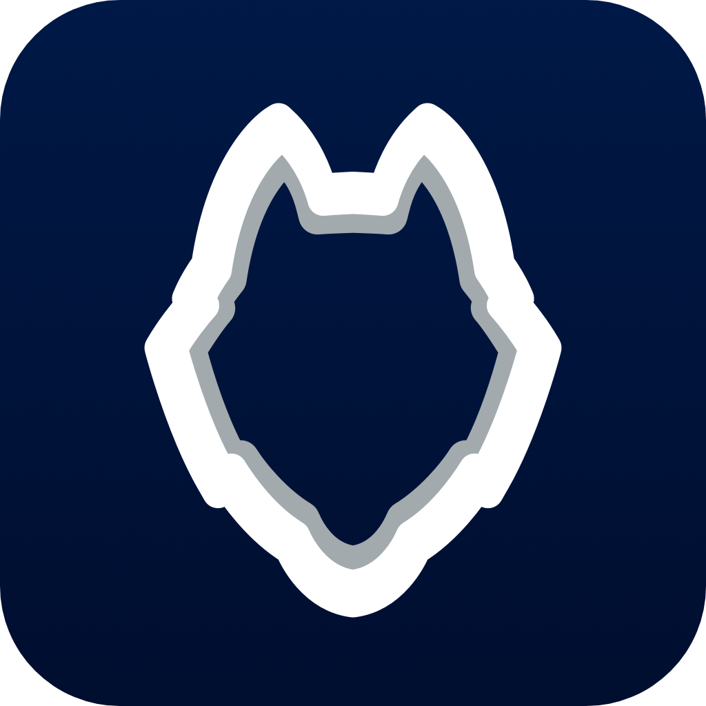

  

# Hubsky
An iOS app with a suite of essential tools built for UConn students

  
	
  

#
> Built with <a href="https://reactnative.dev/" target="_blank">React Native</a> (managed by <a href="https://expo.dev/" target="_blank">Expo</a>), <a href="https://tailwindcss.com/" target="_blank">Tailwind CSS</a>, and <a href="https://reactnavigation.org/" target="_blank">React Navigation</a>. Using <a href="https://onesignal.com/" target="_blank">OneSignal</a> for notifications and <a href="https://vexo.co/" target="_blank">Vexo Analytics</a> for analytics and usage data.
#

### Introducing Hubsky – Your Ultimate Campus Companion!

Welcome to Hubsky, the all-in-one app designed to streamline your college experience! Hubsky is the go-to destination for students looking to stay organized, well-fed, and connected on campus. With a sleek and intuitive interface, this app seamlessly integrates essential tools to enhance your university life.

#### DINING DELIGHT
Hungry for information? Hubsky's dining hall menus let you effortlessly check what's cooking in your campus dining halls. No more guessing or wandering around – plan your meals with ease and satisfy your cravings without any hassle.

#### CLASS SCHEDULER
Tired of juggling multiple schedules and missing important classes? Hubsky's Class Scheduler is here to simplify your academic life. Add and organize your classes with a few taps, create a personalized weekly schedule, and receive timely reminders to ensure you never miss a lecture or seminar.

#### TECH SERVICE STATUS
Stay in the loop with Hubsky's IT Service Status feature. Whether you're troubleshooting connectivity issues or curious about the status of campus-wide tech services, Hubsky provides real-time updates to keep you informed. No more surprises – just smooth, uninterrupted access to the digital resources you need.

#### WHY HUBSKY?
Hubsky is designed to optimize your daily routine, putting everything you need in one place. Spend less time searching and more time focusing on what matters – your education and well-being. Hubsky isn't just an app; it's a community hub.

· · ·

Download Hubsky now and embark on a smoother, more organized college journey. Whether you're navigating your class schedule, planning meals, or staying updated on IT services, Hubsky is your reliable campus companion. Elevate your university experience – the smart way, the Hubsky way.

#

© Hubsky 2024 All Right Reserved.
